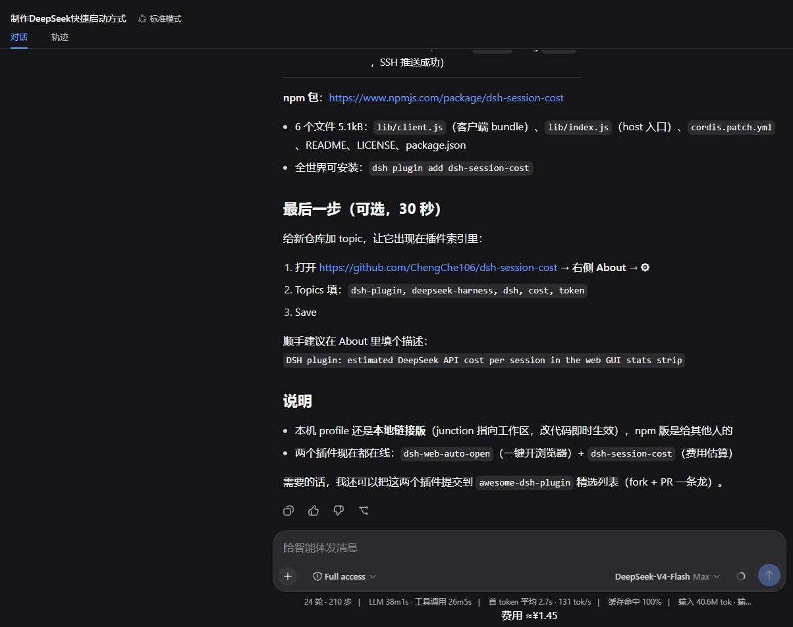

# 会话费用统计（dsh-session-cost）

> **个人维护副本** —— 派生自 [ChengChe106/dsh-session-cost](https://github.com/ChengChe106/dsh-session-cost)（MIT）。
> 与上游 0.1.3 的差异：
> 1. flash 单价已按 2026-09-25 官网页面校正（上游仍是调价前的旧值）；
> 2. 高峰时段补上"仅周一至周五"判断；
> 3. 内置 2026 年法定节假日表（假期全天按谷价）；
> 4. 费用按**分时段账本**累计，跨峰谷不再把整段对话按当前单价重算；
> 5. 底部条目追加峰谷档位标记（峰价红 / 谷价绿）；
> 6. 会话头部新增**「费用」详情入口**，弹窗按小时列出用量与费用。

DSH（DeepSeek Harness）插件：显示**当前会话的 DeepSeek API 费用估算**。



## 显示在哪

**底部统计条**（`conversation.composer.dock`）多出一行：

```
费用 ≈¥0.35 · 谷价 | 命中 ¥0.28 | 未命中 ¥0.02 | 输出 ¥0.05
```

字体与配色对齐官方统计条（12px、主题自适应）；档位标记随当前计价时段变化。

**会话头部右侧的「费用」按钮** → 点开是弹窗，按小时列出 token 用量与费用（见下文「详情面板」）。

## 安装（本地副本，不走 npm）

本副本以 `link:` 方式挂进 DSH profile：

```jsonc
// ~/.dsh/profiles/web/package.json
"dependencies": {
  "dsh-session-cost": "link:I:/Deepseek work/dsh-session-cost"
}
```

`bundles` 数组里登记的仍是 `dsh-session-cost`（包名保持英文，npm 规范不允许中文）。改完在 profile 目录跑一次 `pnpm install`，然后**重启 `dsh web` 生效**。

## 怎么算的

- 数据源：DSH 的 `tokenUsage` 会话投影（官方 `dsh-token-meter` 提供，与统计条同源）：`uncachedInputTokens` / `cacheReadTokens` / `cacheWriteTokens` / `outputTokens`
- 计费口径（对应官方账单）：缓存**写入**按"未命中"单价计
  `费用 = (未命中 + 写入) × miss单价 + 命中 × hit单价 + 输出 × out单价`
- 价格：官方 https://api-docs.deepseek.com/zh-cn/quick_start/pricing

| 模型 | 百万输入（命中） | 百万输入（未命中） | 百万输出 |
| --- | --- | --- | --- |
| deepseek-flash · 高峰 | ¥0.04 | ¥2 | ¥8 |
| deepseek-flash · 空闲 | ¥0.02 | ¥1 | ¥4 |
| deepseek-v4-pro · 高峰 | ¥0.30 | ¥9 | ¥27 |
| deepseek-v4-pro · 空闲 | ¥0.15 | ¥4.5 | ¥13.5 |

- **高峰时段**：北京时间周一至周五、非法定节假日的 9:00-12:00 与 14:00-18:00（**12:00-14:00 是空闲的午休空档**）
- **其余全部按空闲计**：周末、法定节假日全天、工作日其余时段
- 2026-08-17 00:00（北京时间）起自动切换峰谷计价；早于该时刻的用量仍按平峰价（flash ¥0.02/¥1/¥2，pro ¥0.025/¥3/¥6）

### 分时段账本

`tokenUsage` 投影只有累计值、没有时间维度，所以插件**每分钟采样一次**，取相邻两次的快照差作为该区间的用量，按**采样那一刻的档位单价**记账；账本按 `sessionId` 存在 localStorage（落盘节流 5 秒），刷新页面与重启 `dsh web` 都接着算。

- 跨 9:00 / 12:00 / 14:00 / 18:00 时，前后两段各按各的价，**不会**把整段对话按当前单价重算
- 误差只出在**跨档位的那一个采样周期**里：该周期产生的用量会被整块归到采样时刻的档位，最坏是 1 分钟的用量
- 增量为负时（会话切换、投影回退）只对齐快照、不记账，账本不会被减成负数

## 详情面板

会话标题旁（`conversation.session.header.actions`）的「费用」按钮，用 DSH 原生 `Modal`（`@deepseek-ai/dsh-client-ui-primitives`）弹出：毛玻璃遮罩、Escape 与点遮罩均可关闭。

表格按小时**倒序**（最近的在最上面）：

| 列 | 含义 |
| --- | --- |
| 时间 | 北京时间的整点，如 `09-25 15:00` |
| 档位 | 该小时的计价档位：峰价（红）/ 谷价（绿）/ 平峰 / 跨档 |
| 命中 / 未命中 / 输出 | 该小时的 token 量（`1.2k` / `1.23M` 紧凑显示） |
| 费用 | 该小时费用，已按各采样时刻的档位计得 |

- **保留最近 7 天**，更早的小时桶在每次采样时丢弃
- 「跨档」标记实际不会出现：时段边界都在整点，一个小时必然只属于一个档位；该分支保留作为防御
- **座位选择**：入口挂在 `conversation.session.header.actions`（标题旁，`list` 类型）。`corner` 是 `single` 座位、被右侧边栏的展开按钮占着（面板收起时它才渲染内容），注册过去会把那个按钮顶掉；`utilities` 是 header 右端（打开本地目录、侧边栏按钮那一排），按钮会落到右上角而不是标题旁

## 说明与限制

- **估算值**：仅供参考，与实际账单可能有出入（缓存写入归入未命中的口径、模型切换、四舍五入）；显示"≈"标记
- **模型**：v1 按 `flash` 计（会话中途切换模型不追溯）；要改默认模型或价格，编辑 `lib/client.js` 顶部的 `DEFAULT_MODEL` 与两个价格常量
- **账本是本地状态**：清浏览器存储、换浏览器会让它重新初始化——此时把已发生的用量整块记到**当前档位**（等同旧的"总体 × 当前单价"），之后逐分钟转准，数字不会掉到 0
- **法定节假日**：已内置 2026 年国务院放假安排（`lib/client.js` 的 `HOLIDAYS`），假期期间全天按谷价；**2027 年安排公布后需自行追加**（国务院通常在上一年 11 月发布）
- **调休补班的周末仍按空闲计**：官方价格页按时段定义"周一至周五 / 周末及节假日"，未提及调休工作日，故本插件亦不区分；若官方后续明确，改 `isPeakBeijing` 即可

## 维护

- 本副本目录：`I:\Deepseek work\dsh-session-cost`
- **无构建步骤**：`lib/client.js`（浏览器端：价格表 + 节假日表 + 分时段账本 + 组件）与 `lib/index.js`（host 端空操作，只为让 bundle 行能加载）就是源码，直接改
- **改动何时生效**（这条踩过坑，别记混）：
  - 改 `lib/client.js` —— 客户端 JS 内容 → **热加载，存盘后刷新页面即可**
  - 改 `package.json`、`locale/*.json` —— 插件元数据与显示名在启动期定稿 → **要重启 `dsh web`**
  - 改 profile 的依赖或 `bundles` → **要重启 `dsh web`**
- 官方调价时 → 改 `lib/client.js` 的 `TIERED_PRICES`（必要时连 `FLAT_PRICES`）
- 每年 11 月国务院公布次年安排后 → 往 `HOLIDAYS` 里追加次年日期
- 上游若发新版，用 `git fetch upstream` 对比，别直接覆盖本地改动

## 开发者

- 上游仓库：https://github.com/ChengChe106/dsh-session-cost
- 协议：MIT（版权归原作者 ChengChe106）
